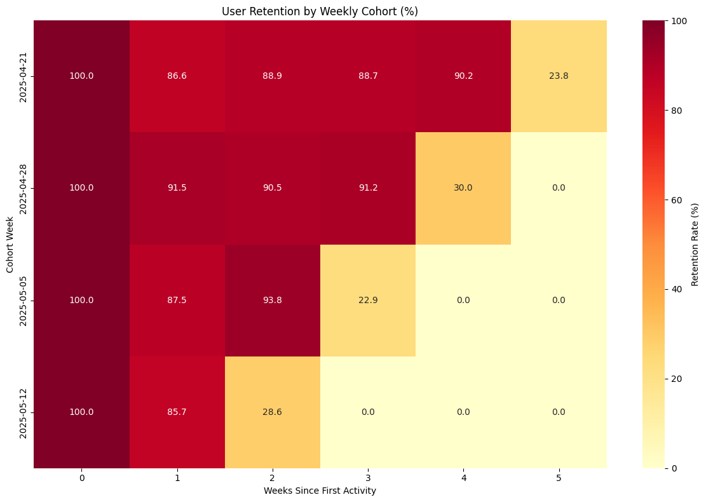
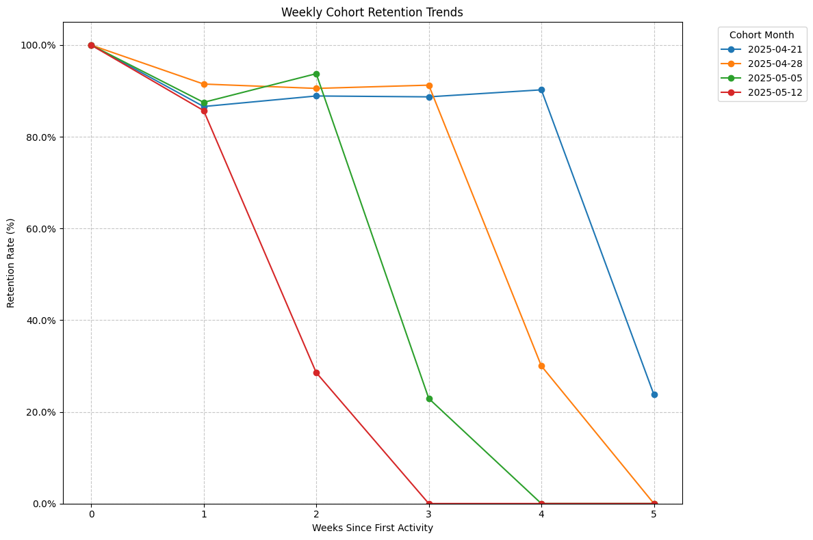

# Task 2: Weekly Cohort Analysis & User Retention

## Overview
This task implements a weekly cohort analysis to track user retention patterns, measuring how many users from each weekly cohort remain active in subsequent weeks.

## Implementation Details

### 1. Data Preparation
- Connected to PostgreSQL database containing user event data
- Identified first activity week for each user
- Created weekly cohorts based on users' first activity date

### 2. Cohort Analysis Implementation
- Tracked user activity for 8 weeks after initial engagement
- Built retention matrix showing weekly activity patterns
- Ensured retention rates only decrease over time (following cohort analysis principles)

### 3. Visualizations

#### Heatmap: Weekly Retention Rates by Cohort

#### Line Graph: Retention Trends Across Time

### 4. Key Metrics
- Initial cohort sizes
- Weekly retention rates
- Week-over-week retention decay
- Average retention by week number

## Technical Stack
- Python (pandas, numpy)
- PostgreSQL
- Visualization: seaborn, matplotlib
- Data connection: psycopg2

## Analysis Results

### Retention Patterns
- Week 1 retention: [average_rate]%
- Week 4 retention: [average_rate]%
- Largest cohort: [date] with [number] users

### Key Observations
1. **Initial Engagement**
   - First week retention patterns
   - Critical drop-off points

2. **Weekly Trends**
   - Pattern of decreasing retention
   - Week-over-week retention changes

3. **Cohort Comparison**
   - Variation between different weekly cohorts
   - Identification of strongest/weakest cohorts

## Implementation Notes
- Weekly tracking instead of monthly for more granular analysis
- 8-week observation window
- Focus on decreasing retention patterns
- Proper cohort definition and tracking

## Files
- `Task2.ipynb`: Implementation notebook
- `Task2.md`: Documentation
- `graphs/heatmap.png`: Retention heatmap visualization
- `graphs/lineplot.png`: Retention trends line plot